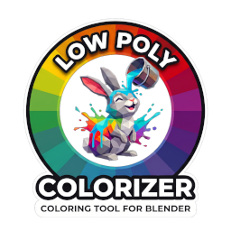

<p align="center">
  
</p>

# Low Poly Colorizer Demo


A playable puzzle cube in Godot 4.8 that shows what
[Low Poly Colorizer](https://github.com/wasdcat/low-poly-colorizer) (LPC) can do
in a game engine. LPC is a Blender extension for painting low-poly models face by
face, using colors from one palette texture and PBR presets. With one click it
exports its materials and shaders to Godot 4.

Every body and sticker of the cube uses the same exported material,
`lpc_singlecolor`. Switch color schemes and material presets while you play,
and the whole cube changes look without any new textures or materials.

## What it shows

- **One palette, many looks.** The sticker schemes (Classic, Showroom with mixed
  presets, Neon, Rainbow, Shades, Greyscale) and the body looks (Black, White,
  Steel, Gold) are small `.tres` resources in [src/looks/](src/looks/). Each one only
  points to a palette cell and a preset. *Random* rolls a new scheme at runtime.
- **Built at runtime.** The cube is built from just two meshes, a body and a
  sticker, in any size from 2×2×2 to 7×7×7. Every turn is an animated rotation
  of a real layer.
- **All LPC code in one file.** [src/scripts/cube_looks.gd](src/scripts/cube_looks.gd)
  holds every call into the LPC export, so it is the file to read. The exported
  files themselves are in [src/assets/materials/lpc/](src/assets/materials/lpc/), along
  with notes on their import settings.

## Controls

| Input | Action |
|-------|--------|
| Mouse wheel | Turn the column under the cursor |
| Shift + wheel | Turn the row under the cursor |
| Alt + wheel | Turn the face under the cursor |
| Middle mouse button + drag | Orbit the view |
| Ctrl + wheel | Zoom |
| Ctrl + Z | Undo the last turn |
| Esc | Close a window or quit |

**Scramble to Play** starts a game. Try to solve the cube in as few moves as you
can. The UI is available in English and German.

## Download

The [latest release](releases/latest) comes with builds for Windows, Linux
and macOS. Unzip one and start it; nothing needs to be installed.

The macOS build is not notarized by Apple. On its first start macOS refuses to
open it. To allow it, go to **System Settings ▸ Privacy & Security** and click
**Open Anyway**.

## Running it from source

Open `src/project.godot` in **Godot 4.8** and press **F5**.

The tests run headless:

```bash
godot --headless --path src --script res://tests/run_tests.gd
```

GitHub Actions runs them on every push. Publishing a release exports the three
builds and attaches them to it, and removes the builds of older releases.

## License

This project is licensed under the [MIT License](LICENSE) — with the exception of the Low Poly Colorizer and WASDCAT Games logos, which remain the property of Frank Winter and are not covered by this license.